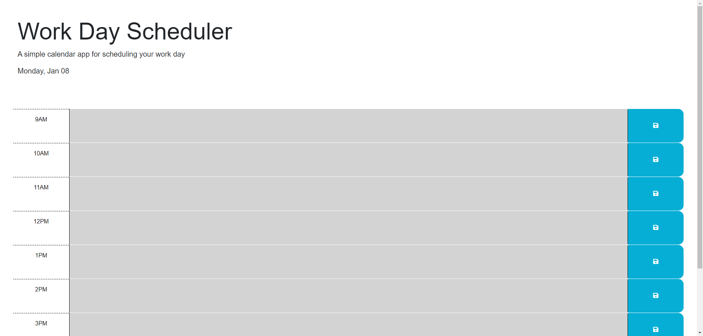

# Work Day Scheduler

## Description

This is a work day scheduler made primarily using JavaScript. You are able to see the hours of 9-5 PM, which will be colored grey, red, or green based off if the current time has past, is current, or is in the future. 
You are able to type in each of the time blocks and save it using the blue save button. This will then save whatever you typed to the local storage, and will remain on the page upon refresh.

## Usage

https://rb2277.github.io/work-day-scheduler/

## Credits

## License

N/A
